<a href="https://www.omsharma.dev">
  <picture>
    <source media="(prefers-color-scheme: dark)" srcset="./assets/dark.svg">
    <source media="(prefers-color-scheme: light)" srcset="./assets/light.svg">
    
  </picture>
</a>

 

I build real-time AI systems that feel instant: voice agents, LLM orchestration, and the infrastructure that gets a model answering inside two seconds.

**Latest writing:** [Where the milliseconds go: anatomy of a sub-2s voice AI pipeline](https://medium.com/@OmsharmaOfficial/where-the-milliseconds-go-f43cbb30f716)

[omsharma.dev](https://www.omsharma.dev) &nbsp;&nbsp; [LinkedIn](https://www.linkedin.com/in/omsharmaofficial) &nbsp;&nbsp; [Medium](https://medium.com/@OmsharmaOfficial) &nbsp;&nbsp; [justomsharma@gmail.com](mailto:justomsharma@gmail.com)

The card is rebuilt every morning by a GitHub Action from live API numbers. The source is in <a href="./generator">generator/</a>.
